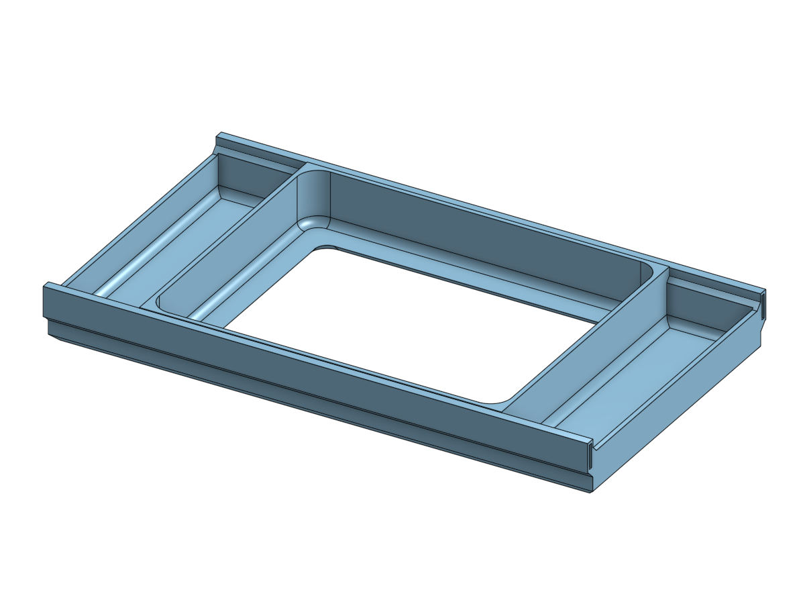
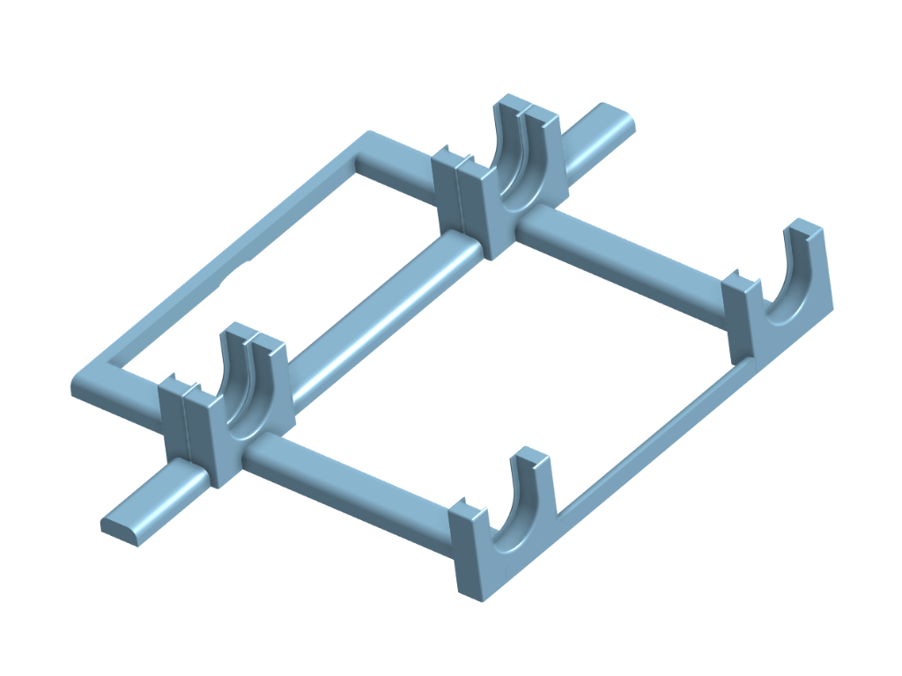

# Mobile File Box Filament Dry Box
Mobile file boxes make excellent dry boxes. It has a hinged top lid that can store commonly used tools and parts your 3D printer needs. Inside, it has enough space for 3 - 1 kg spools and a plug-in  dehumidifier.

Complete Instructions coming soon.

Sponsored by [Lexis Coatings - Your Roof Reborn](https://lexiscoatings.com)

***
## Dehumidifier Tray
This is designed for the EVA Dry Dehumidifier.

***
## File Box Spool Holders
There is 3.23" between the bearings so most 1kg spools, 8" in diameter will fit just fine. The only exception I've seen would be the old style spools that are 3.5" wide and 6.25" in diameter.

